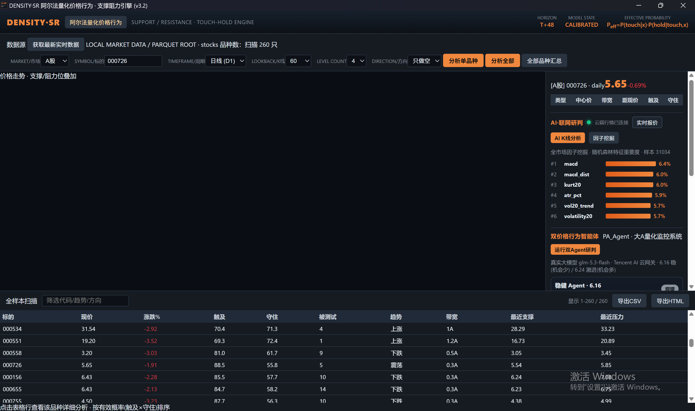
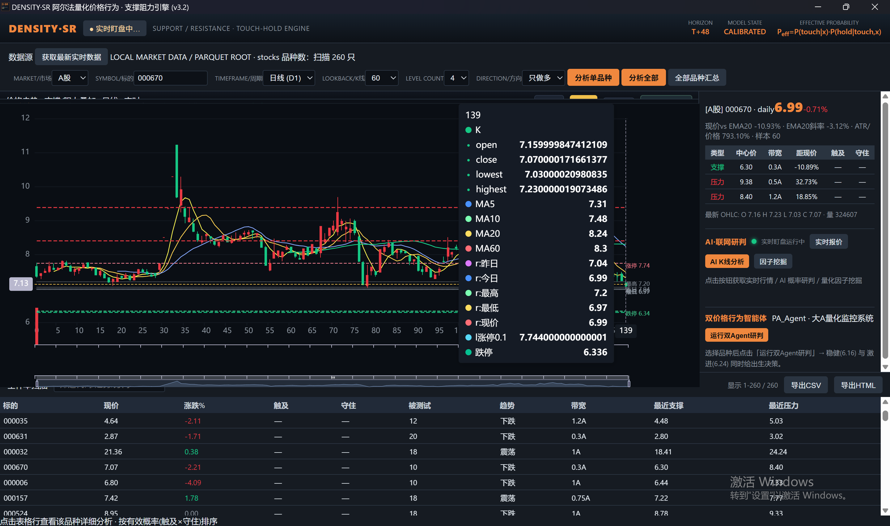
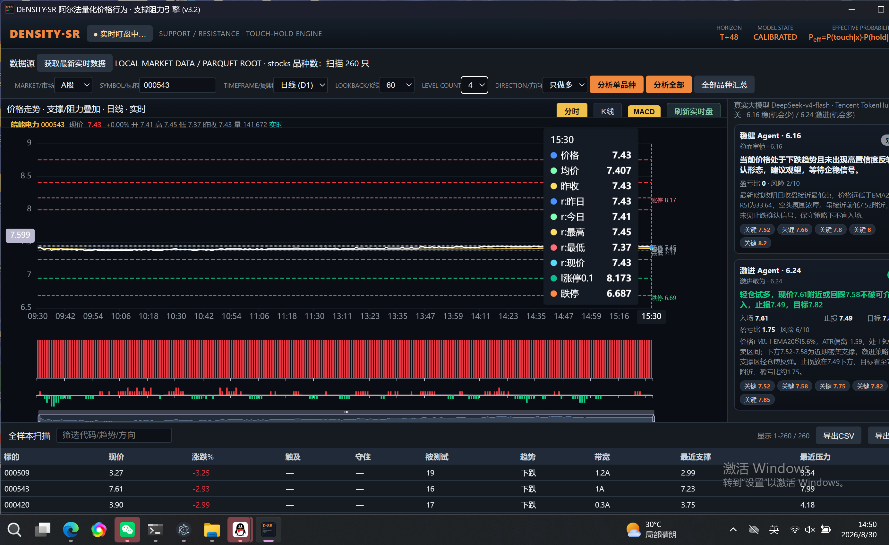
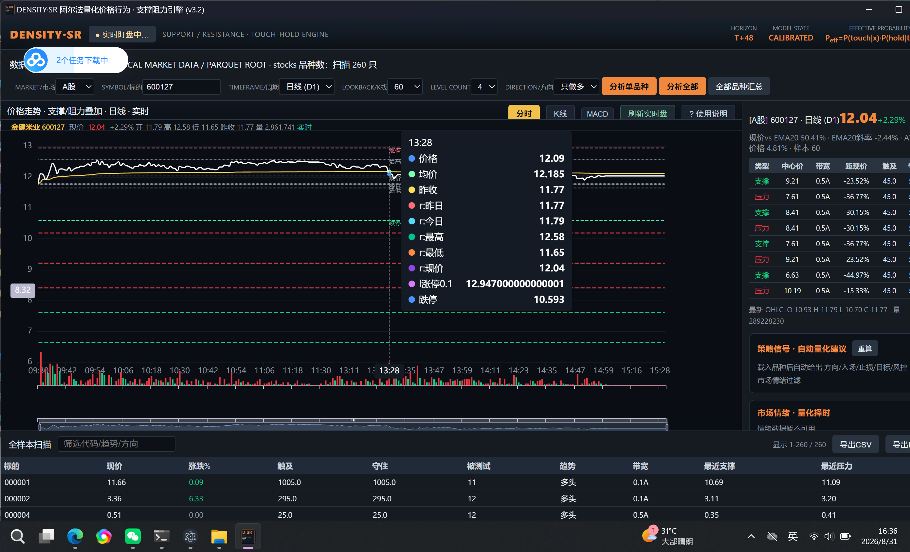

# 产品截图 / Screenshots

> 桌面端 (Windows 单文件 EXE) 实际运行截图，覆盖 DENSITY-SR 阿尔法量化价格行为引擎 v3.2 的关键工作流。
>
> 截图版本：`v2026.08`  ·  数据源：A 股 + MT5 + OKX

| # | 截图 | 说明 |
|---|------|------|
| 01 |  | **全市场扫描 + 因子挖掘** — 数据源页一键扫描 A 股 260 只（已配置样本），上方按代码 / 趋势 / 方向筛选；右侧 AI K线研判 + 因子挖掘面板，Top 6 因子实时排名：`macd 6.4%` · `macd_dist 6.0%` · `kurt20 6.0%` · `atr_pct 5.9%` · `vol20_trend 5.7%` · `volatility20 5.7%`；下方「全样本扫描」表按 触底 / 守佳 / 被测试 / 趋势 / 带宽 排序。双价格行为智能体（PA_Agent 稳健/激进）实时跟进。 |
| 02 |  | **K线图 + 实时盯盘** — 个股 (000670) 日线图叠加 MA5 / MA10 / MA20 / MA60 均线，右侧实时 K线 7.30、支撑/压力位分层显示；上方面板 `Yvs EMA20 -10.93%`、`EMA20 斜率 -3.12%`；最近 OHLC + 量价 实时滚动。AI K线研判 + 因子挖掘 + 双 Agent 融合信号三件套。 |
| 03 |  | **分时图 + 双 Agent 实时研判** — 个股 (000543) 当日分时图，分钟级柱状 + 跟随均线；右栏同时挂载两个 LLM Agent： • **微盟 Agent** 6.16（稳健风格） • **激流 Agent** 6.24（激进风格，关键 7.61 / 止损 7.49 / 目标 7.5x） 两者打分独立、可一键切换风格；下方 5min / 15min / 30min / 60min / 今日 多周期同步。 |
| 04 |  | **实时盯盘 + 自动量化建议** — 个股 (600127) 实时行情 +2.29%，分时柱状 + 实时价量；右侧 `YvsEMA20 5.041%`、`EMA20 斜率 -2.44%`、ATR 等核心指标自动跟踪；**「策略信号 · 自动量化建议」** 与「市场接 · 量化择时」面板直接给出入场 / 止损 / 目标三档位（保守 / 中性 / 激进），支持一键复算。 |

---

> 全部截图均为 DENSITY-SR 桌面端真实运行界面，未做修饰；体积合计约 2.4 MB。
